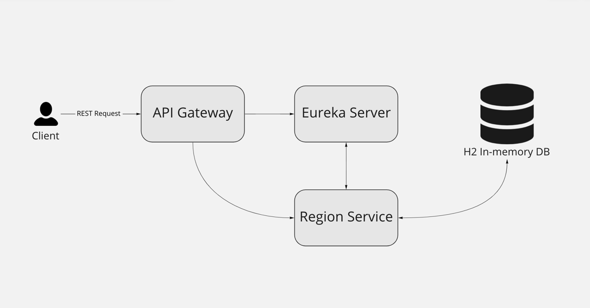

# interview-telda-regions



# How To:

### Execution

(assuming you have docker installed)

For live demo navigate to root folder of the project (`interview-telda-regions/`) and run a
command `docker-compose up` <br/>
All containers utilize RAM or their docker container space, so you won't need to clean up after execution. Except for
the containers and images of course...

For project to work properly port 80(api) and 8761(eureka-dashboard) must be available

[Preconfigured Postman requests](https://www.getpostman.com/collections/1e65f01a54acea811691) will walk you through
basic app functionality such as `getting all region` `adding a region` `updating a region` and `deleting a region`
Or you can find them in project root folder btw.

#### ⚠️ Project utilizes Eureka Server, so it may take a few minutes for services to spin up

If docker is not an option - `regionservice` is configured to work as a standalone application. <br/>
Run `RegionserviceApplication.class` for application to start. After that you can execute provided Postman Requests (but
you must change port of localhost from 80 to 8085)

### Tests

In case you'd like to check if everything is working correctly (as long as unit tests go) - run `mvn test` from root
folder

# Task Description

```
Создать приложение используя Spring Boot реализующее справочник регионов
(свойства: идентификатор, наименование, сокращённое наименование), 
предоставляющее REST-API на чтение и изменение справочника, справочник 
должен храниться в БД в качестве ORM необходимо использовать MyBatis.
Преимуществом будет использование Spring Cache.

Использовать встроенные БД и сервер приложений.
```

#### This is (except for the `regionservice`) a very basic implementation that is designed to bootstrap and build this project

| Module                                                                                                            | Description                                                                                              | Tech                                                                                                      |
|-------------------------------------------------------------------------------------------------------------------|----------------------------------------------------------------------------------------------------------|-----------------------------------------------------------------------------------------------------------|
| [apiGateway](https://github.com/mityavasilyev/interview-telda-regions/tree/master/apiGateway)                     | Acts as an API entrypoint. Enables future scaling since using microservice architecture                  | [Spring Gateway](https://spring.io/projects/spring-cloud-gateway)                                         |
| [eurekaRegistryServer](https://github.com/mityavasilyev/interview-telda-regions/tree/master/eurekaRegistryServer) | Registers and maps all of the services. Simple demo implementation. Can be accessed via `localhost:8761` | [Eureka Server](https://cloud.spring.io/spring-cloud-netflix/multi/multi_spring-cloud-eureka-server.html) |
| [regionservice](https://github.com/mityavasilyev/interview-telda-regions/tree/master/regionservice)               | ⚠️ Actual task showcase. Further and more detailed documentation can be found inside service folder      | Can be found in folder's README                                                                           |

### All further description of `regionservice` can be found [here](https://github.com/mityavasilyev/interview-telda-regions/tree/master/regionservice)

# Extra

[POSTMAN Demo Request Collection for this project](https://www.getpostman.com/collections/1e65f01a54acea811691)